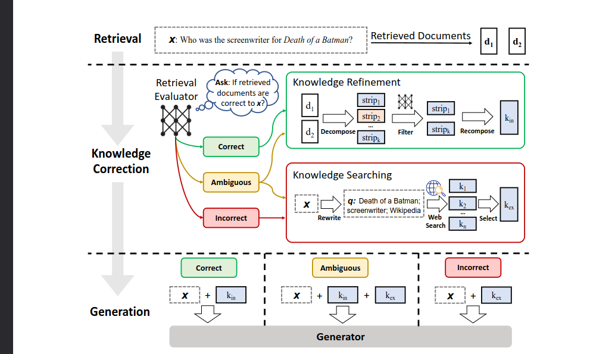

# Corrective RAG (CRAG)

Basic RAG has one weak assumption baked in: whatever the retriever returns is treated as good enough to answer from. Corrective RAG removes that assumption by **grading** the retrieval before generation, and reacting differently depending on how good it actually was.

A **Retrieval Evaluator** scores each retrieved chunk and grades the retrieval as a whole into one of three verdicts:

- **Correct** — at least one chunk is clearly good enough on its own. The chunks are refined (decompose → filter → recompose, dropping irrelevant sentences) before answering.
- **Ambiguous** — mixed signal, something useful but nothing conclusive. The chunks are refined *and* a web search fills the gaps.
- **Incorrect** — every chunk is weak. The retrieval is discarded outright and replaced with a web search instead.

Generation then answers from whichever combination of internal (book) and external (web) knowledge that verdict produced. That's what makes it "corrective": a weak retrieval never reaches generation unfiltered, and a hopeless one doesn't reach it at all.

## Notebooks

Each notebook adds one piece, in order:

1. `01_basic_rag` — plain retrieve → generate, no grading.
2. `02_retrieval_refine` — adds refinement: split retrieved text into sentences, keep only the relevant ones.
3. `03_retrieval_evaluator` — adds grading: score each chunk, label the retrieval Correct / Incorrect / Ambiguous.
4. `04_web_search_fallback` — adds a web search fallback for Incorrect.
5. `05_query_rewrite` — rewrites vague questions before retrieval, so the search itself is better.
6. `06_ambiguous_augmentation` — stops discarding Ambiguous; combines book and web evidence instead.
